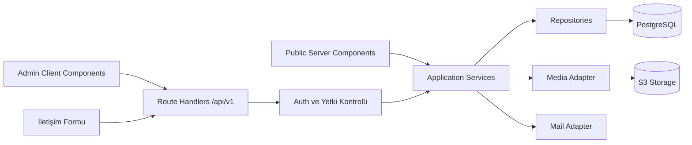

# Reha Spor Backend ve Entegrasyon Ana Planı

> Durum: Faz 0, Faz 1 ve Faz 2 seed akışı tamamlandı; temiz veritabanı tekrar testi bekliyor  
> Son güncelleme: 25 Temmuz 2026  
> Amaç: Bu doküman, Reha Spor frontend demosunu güvenli, kalıcı veriye bağlı ve üretime alınabilir tam bir uygulamaya dönüştürmek için ana çalışma kaynağıdır.

### Mevcut ilerleme

- [x] Mevcut frontend ve mock veri yapısı incelendi.
- [x] Hedef backend mimarisi seçildi.
- [x] Temel ürün ve işletim kararları kesinleştirildi.
- [x] Node/npm, Prisma/Zod, ortak server katmanı ve health endpoint iskeleti kuruldu.
- [x] Yerel PostgreSQL 18.4 bağlantısı doğrulandı ve `rehaspor` veritabanı oluşturuldu.
- [x] Next.js 16.2.11 ve React 19.2.8'e kontrollü geçiş tamamlandı; tip, lint ve production build başarılı.
- [!] Güncel audit'te Next.js zincirinden gelen PostCSS/Sharp ve Prisma CLI zincirinden gelen transitive açıklar raporlanıyor. Zorlayıcı otomatik düzeltme güvenli olmadığı için sonraki güvenli upstream sürümde yeniden değerlendirilecek.
- [x] Prisma iş modeli, foreign key ve indeks tasarımı doğrulandı.
- [x] İlk migration local PostgreSQL üzerinde üretildi ve uygulandı.
- [x] Mock veriler için idempotent seed yazıldı ve local PostgreSQL'e aktarıldı.
- [x] Uygulama içi health readiness smoke testi local PostgreSQL'e karşı başarılı.

İş tabloları, migration, seed, auth, storage ve mail entegrasyonu henüz kurulmadı.

## 1. Hedef

Mevcut Next.js uygulamasındaki public site ve admin arayüzü korunacak; mock veri katmanı kaldırılarak aşağıdaki yetenekler gerçek ve üretime uygun biçimde kurulacaktır:

- PostgreSQL üzerinde kalıcı veri
- Güvenli admin kimlik doğrulaması ve yetkilendirme
- Kategori, ürün, referans, katalog ve site ayarı yönetimi
- İletişim formu ve admin mesaj kutusu
- Görsel ve PDF dosya yönetimi
- Public sayfalarda doğru cache ve yeniden doğrulama
- Audit log, hata izleme, yedekleme ve operasyon süreçleri
- Otomatik testler ve kontrollü dağıtım

Bu plan tamamlandığında uygulama yalnızca bir frontend demosu olmayacak; içeriklerin admin panelinden yönetilebildiği tam çalışan bir kurumsal web uygulaması olacaktır.

## 2. Temel Mimari Kararı

### 2.1 Seçilen yaklaşım

Başlangıç mimarisi **Next.js içinde modüler monolith** olacaktır.

- UI: Next.js App Router ve React
- Backend HTTP katmanı: Next.js Route Handlers
- Uygulama ve iş kuralları: `src/server/modules`
- Veritabanı: PostgreSQL
- ORM ve migration: Prisma
- Şema doğrulama: Zod
- Kimlik doğrulama: Sunucu tarafında saklanan opaque session ve güvenli cookie
- Dosya depolama: S3 uyumlu object storage
- E-posta: Sağlayıcıdan bağımsız bir mail adapter'ı

Ayrı backend servisi veya mikroservis kurulmayacaktır. Mobil uygulama, üçüncü taraf istemciler, bağımsız ölçekleme ya da ayrı backend ekibi gibi gerçek bir ihtiyaç oluşursa modüller ayrı servise taşınabilir.

### 2.2 İstek akışı



Public Server Component'lar kendi uygulamasına HTTP isteği atmayacak; servis katmanını doğrudan çağıracaktır. Admin tarayıcı kodu ve iletişim formu `/api/v1` Route Handler'larını kullanacaktır.

### 2.3 Katman kuralları

- Route Handler yalnızca HTTP, auth, input parsing ve response üretiminden sorumludur.
- İş kuralları service katmanında bulunur.
- Prisma sorguları yalnızca repository/veri erişim katmanında bulunur.
- UI dosyaları Prisma'ya veya veritabanına doğrudan erişmez.
- Client Component'lara hassas veri, secret veya Prisma nesnesi aktarılmaz.
- Public ve admin DTO'ları veritabanı modellerinden bağımsız tutulur.
- `src/data` içindeki mock veriler üretim veri kaynağı olarak kullanılmaz.

### 2.4 Kesinleşen ürün kararları

- İlk sürüm yalnızca Türkçe olacaktır. Kimlikler ve ilişkiler dilden bağımsız tasarlanacak; ileride çeviri tabloları eklenebilmesi engellenmeyecektir.
- Başlangıçta tek `ADMIN` kullanıcısı olacaktır. Kullanıcı ve yetki modeli ileride yeni roller eklenebilecek şekilde kurulacaktır.
- İçerikler `DRAFT`, `PUBLISHED` ve `ARCHIVED` durumlarını destekleyecektir.
- Ürün, kategori ve referans kayıtları fiziksel olarak hemen silinmeyecek; arşivleme/soft-delete kullanılacaktır.
- İletişim mesajları önce veritabanına güvenli biçimde kaydedilecektir. Mail servisi tanımlıysa ayrıca bildirim gönderilecek; mail hatası mesaj kaydını kaybettirmeyecektir.
- Domain, veritabanı, storage ve mail hesapları canlıya geçişte müşteriye ait hesaplarda tutulacaktır.
- Demo ve geliştirme aşaması sağlayıcı bağımsız yürütülecektir. Domain veya servis sağlayıcısı değişikliği kod değişikliği değil, adapter ve ortam değişkeni değişikliği olmalıdır.

### 2.5 Ortam ve sahiplik yaklaşımı

- `local`: Geliştiricilerin yerel ortamı; gerçek müşteri hesabı gerektirmez.
- `staging/demo`: Müşteriye gösterim ve kabul testleri için geçici ortam.
- `production`: Müşteri tarafından sahip olunan hesaplar, domain, veritabanı, storage ve mail servisi.
- Production erişimleri kişisel geliştirici hesaplarına kalıcı olarak bağlanmaz.
- Uygulama taşınabilir olmalı; sağlayıcıya özel kod yalnızca integration adapter'larında bulunmalıdır.

## 3. Hedef Klasör Yapısı

```text
prisma/
  schema.prisma
  migrations/
  seed.ts

src/
  app/
    api/
      v1/
        auth/
          login/route.ts
          logout/route.ts
          session/route.ts
        admin/
          categories/route.ts
          categories/[id]/route.ts
          products/route.ts
          products/[id]/route.ts
          references/route.ts
          references/[id]/route.ts
          catalogs/route.ts
          catalogs/[id]/route.ts
          messages/route.ts
          messages/[id]/route.ts
          settings/route.ts
          media/presign/route.ts
          media/complete/route.ts
        contact/route.ts
  server/
    auth/
      password.ts
      session.ts
      authorization.ts
      csrf.ts
    db/
      prisma.ts
      transaction.ts
    http/
      errors.ts
      response.ts
      request.ts
    modules/
      categories/
      products/
      references/
      catalogs/
      settings/
      messages/
      media/
      audit/
    integrations/
      storage/
      mail/
    cache/
      tags.ts
      revalidate.ts
  contracts/
    auth.ts
    category.ts
    product.ts
    reference.ts
    catalog.ts
    message.ts
    media.ts
    settings.ts
  lib/
    public-data.ts
    admin-api-client.ts
```

Her modül gerektiği ölçüde şu dosyaları içerir:

```text
schema.ts       # Zod input şemaları
types.ts        # Modüle özel tipler
service.ts      # İş kuralları
repository.ts   # Prisma/veri erişimi
mapper.ts       # DB modeli -> DTO dönüşümü
errors.ts       # Modüle özel hatalar
```

## 4. Veri Modeli

Tüm ana tablolarda:

- `id`: UUID/CUID türü kararlı kimlik
- `createdAt`
- `updatedAt`
- Gerekli tablolarda `deletedAt`

bulunacaktır. Tarihler veritabanında UTC saklanacak, kullanıcıya Türkiye saat diliminde gösterilecektir.

### 4.1 Kullanıcı ve oturum

#### `users`

- `id`
- `email` — unique, normalize edilmiş
- `passwordHash`
- `displayName`
- `role` — başlangıçta `ADMIN`
- `status` — `ACTIVE`, `DISABLED`
- `lastLoginAt`
- `createdAt`, `updatedAt`

#### `sessions`

- `id`
- `userId`
- `tokenHash` — ham session token veritabanına yazılmaz
- `expiresAt`
- `lastSeenAt`
- `ipHash` — opsiyonel
- `userAgent` — sınırlandırılmış uzunluk
- `createdAt`

Kurallar:

- Şifreler Argon2id ile hash edilir.
- Cookie `HttpOnly`, `Secure`, `SameSite=Lax` veya daha sıkı olarak ayarlanır.
- Session kimliği localStorage'a yazılmaz.
- Login sırasında session fixation engellenir.
- Çıkışta session sunucudan iptal edilir.
- Pasif kullanıcıya ait tüm session'lar reddedilir.

### 4.2 Kategoriler

#### `categories`

- `id`
- `title`
- `slug` — unique
- `description`
- `imageAssetId` — nullable
- `sortOrder`
- `status` — `DRAFT`, `PUBLISHED`, `ARCHIVED`
- `seoTitle` — nullable
- `seoDescription` — nullable
- `createdAt`, `updatedAt`, `deletedAt`

`productCount` veritabanında saklanmaz; ilişkiden hesaplanır.

### 4.3 Ürünler

#### `products`

- `id`
- `code` — unique
- `title`
- `slug` — unique
- `categoryId` — foreign key
- `shortDescription`
- `description`
- `isFeatured`
- `status` — `DRAFT`, `PUBLISHED`, `ARCHIVED`
- `sortOrder`
- `catalogPageAssetId` — nullable
- `catalogPdfAssetId` — nullable
- `seoTitle` — nullable
- `seoDescription` — nullable
- `publishedAt` — nullable
- `createdAt`, `updatedAt`, `deletedAt`

#### Sıralı ürün içerikleri

Teknik detay, kullanım alanı ve uygulama adımları sıralarını kaybetmemelidir:

- `product_technical_details`: `id`, `productId`, `text`, `sortOrder`
- `product_usage_areas`: `id`, `productId`, `text`, `sortOrder`
- `product_application_steps`: `id`, `productId`, `text`, `sortOrder`

#### `product_media`

- `id`
- `productId`
- `assetId`
- `kind` — `MAIN`, `GALLERY`
- `sortOrder`
- `altText`

Ürün-kategori ilişkisi slug ile değil `categoryId` ile tutulur. Slug değişiklikleri ilişkiyi bozmaz.

### 4.4 Referans projeler

#### `references`

- `id`
- `title`
- `slug` — unique
- `city`
- `year`
- `category`
- `description`
- `imageAssetId`
- `status`
- `sortOrder`
- `seoTitle` — nullable
- `seoDescription` — nullable
- `createdAt`, `updatedAt`, `deletedAt`

İleride referans kategorileri admin tarafından yönetilecekse `category` metni ayrı tabloya dönüştürülebilir. İlk sürümde kontrollü enum/list olarak kalabilir.

### 4.5 Kataloglar

#### `catalogs`

- `id`
- `title`
- `language` — başlangıçta `TR`, `EN`
- `description`
- `fileAssetId`
- `status` — `DRAFT`, `PUBLISHED`, `ARCHIVED`
- `version`
- `publishedAt`
- `createdAt`, `updatedAt`

Yeni PDF yüklenirken mevcut yayın hemen silinmez. Yükleme tamamlanıp doğrulandıktan sonra yeni sürüm yayınlanır.

### 4.6 Site ayarları

#### `site_settings`

Tek satırlı/singleton kayıt:

- `id`
- `siteName`
- `phone`
- `email`
- `address`
- `whatsapp`
- `instagram`
- `mapUrl`
- `workingHours`
- `defaultSeoTitle`
- `defaultSeoDescription`
- `updatedAt`

Singleton kuralı service katmanında korunur.

### 4.7 İletişim mesajları

#### `contact_messages`

- `id`
- `fullName`
- `email`
- `phone`
- `subject`
- `message`
- `status` — `UNREAD`, `READ`, `ARCHIVED`
- `source`
- `readAt`
- `readByUserId`
- `createdAt`, `updatedAt`, `deletedAt`

Kişisel veri saklama süresi belirlenmeli; süresi dolan mesajlar otomatik silinmeli veya anonimleştirilmelidir.

### 4.8 Medya

#### `assets`

- `id`
- `storageKey` — unique
- `originalName`
- `mimeType`
- `size`
- `width` — görseller için nullable
- `height` — görseller için nullable
- `checksum`
- `status` — `PENDING`, `READY`, `REJECTED`, `DELETED`
- `uploadedByUserId`
- `createdAt`, `deletedAt`

Veritabanına dosya binary içeriği yazılmaz.

### 4.9 Audit log

#### `audit_logs`

- `id`
- `actorUserId`
- `action`
- `entityType`
- `entityId`
- `beforeJson` — hassas alanlar maskelenmiş
- `afterJson` — hassas alanlar maskelenmiş
- `requestId`
- `createdAt`

Şifre, session token, cookie ve secret değerleri audit log'a yazılmaz.

## 5. API Sözleşmesi

### 5.1 Genel kurallar

- Temel yol: `/api/v1`
- JSON istek ve cevapları
- Zod ile sunucu tarafı doğrulama
- Tutarlı hata formatı
- Liste endpoint'lerinde pagination, filtre ve sıralama
- Admin mutasyonlarında auth + rol kontrolü
- Mutasyonlarda `Origin` doğrulaması
- Her cevapta izlenebilir `requestId`

Başarılı cevap:

```json
{
  "data": {},
  "meta": {
    "requestId": "..."
  }
}
```

Hata cevabı:

```json
{
  "error": {
    "code": "VALIDATION_ERROR",
    "message": "Gönderilen bilgiler geçersiz.",
    "fields": {
      "email": ["Geçerli bir e-posta adresi girin."]
    },
    "requestId": "..."
  }
}
```

İç hata ayrıntıları ve stack trace istemciye gönderilmez.

### 5.2 Auth endpoint'leri

- `POST /api/v1/auth/login`
- `POST /api/v1/auth/logout`
- `GET /api/v1/auth/session`

Login endpoint'inde:

- IP ve hesap bazlı rate limit
- Genel hata mesajı
- Başarılı girişte yeni session
- Güvenli cookie
- Audit kaydı

### 5.3 Admin endpoint'leri

#### Kategoriler

- `GET /api/v1/admin/categories`
- `POST /api/v1/admin/categories`
- `GET /api/v1/admin/categories/:id`
- `PATCH /api/v1/admin/categories/:id`
- `DELETE /api/v1/admin/categories/:id`

Ürünü bulunan kategori doğrudan silinmez. Önce ürünlerin taşınması veya arşivlenmesi gerekir.

#### Ürünler

- `GET /api/v1/admin/products`
- `POST /api/v1/admin/products`
- `GET /api/v1/admin/products/:id`
- `PATCH /api/v1/admin/products/:id`
- `DELETE /api/v1/admin/products/:id`

Liste filtreleri:

- `query`
- `categoryId`
- `status`
- `isFeatured`
- `page`
- `pageSize`
- `sort`

#### Referanslar

- `GET /api/v1/admin/references`
- `POST /api/v1/admin/references`
- `GET /api/v1/admin/references/:id`
- `PATCH /api/v1/admin/references/:id`
- `DELETE /api/v1/admin/references/:id`

#### Kataloglar

- `GET /api/v1/admin/catalogs`
- `POST /api/v1/admin/catalogs`
- `PATCH /api/v1/admin/catalogs/:id`
- `POST /api/v1/admin/catalogs/:id/publish`

#### Mesajlar

- `GET /api/v1/admin/messages`
- `GET /api/v1/admin/messages/:id`
- `PATCH /api/v1/admin/messages/:id/status`
- `DELETE /api/v1/admin/messages/:id`

#### Site ayarları

- `GET /api/v1/admin/settings`
- `PATCH /api/v1/admin/settings`

#### Medya

- `POST /api/v1/admin/media/presign`
- `POST /api/v1/admin/media/complete`
- `DELETE /api/v1/admin/media/:id`

### 5.4 Public yazma endpoint'i

- `POST /api/v1/contact`

Koruma:

- Zod validasyonu
- İstek gövdesi boyut sınırı
- IP bazlı rate limit
- Honeypot alanı
- Gerekirse CAPTCHA
- Loglarda mesaj metninin ve iletişim bilgilerinin maskelenmesi

Public içerik Server Component'larda service katmanından okunur. Harici public API ihtiyacı oluşursa ayrıca salt okunur endpoint'ler açılır.

## 6. Auth ve Admin Koruması

### Yapılacaklar

- [ ] İlk admin kullanıcısını seed veya tek kullanımlık kurulum komutuyla oluştur.
- [ ] Argon2id parola hash yardımcılarını yaz.
- [ ] Session oluşturma, doğrulama, yenileme ve iptal mekanizmasını kur.
- [ ] `/admin/login` dışındaki admin route'larını middleware/layout seviyesinde koru.
- [ ] Her admin API endpoint'inde ayrıca sunucu tarafı auth kontrolü yap.
- [ ] Başarısız login denemelerine rate limit ekle.
- [ ] Cookie ve security header ayarlarını yapılandır.
- [ ] Yetkisiz erişimde sayfa için login yönlendirmesi, API için `401/403` üret.
- [ ] Şifre ve session değerlerinin loglanmadığını test et.

Yalnızca arayüzü gizlemek güvenlik sayılmaz; gerçek yetki kontrolü her mutasyon endpoint'inde uygulanacaktır.

## 7. Medya ve PDF Yükleme Akışı

1. Admin dosya seçer.
2. Frontend dosya adı, MIME ve boyutla `presign` ister.
3. Backend yetkiyi ve dosya politikasını kontrol eder.
4. Backend kısa ömürlü imzalı yükleme adresi üretir.
5. Tarayıcı dosyayı doğrudan object storage'a yükler.
6. Frontend `complete` endpoint'ini çağırır.
7. Backend dosyanın gerçekten var olduğunu, boyutunu ve türünü doğrular.
8. Asset `READY` olur ve içerik kaydına bağlanabilir.

Politikalar:

- Görseller: yalnızca izin verilen JPEG, PNG ve WebP türleri
- Katalog: yalnızca PDF
- Dosya boyutu sınırları
- Tahmin edilemez storage key
- Orijinal dosya adı storage path olarak kullanılmaz
- Gerektiğinde zararlı dosya taraması
- Sahipsiz `PENDING` yüklemeler periyodik temizlenir
- Silinen içeriklerde kullanılan ortak asset yanlışlıkla silinmez

## 8. Mock Veriden Gerçek Veriye Geçiş

### Public taraf

- [ ] `src/lib/api.ts` kullanım haritasını çıkar.
- [ ] Doğrudan `src/data` kullanan `Navbar`, `Footer`, `ProductCard` ve section bileşenlerini düzelt.
- [ ] Server Component'larda `public-data`/service fonksiyonlarını kullan.
- [ ] Client Component'lara yalnızca ihtiyaç duydukları DTO'ları prop olarak geçir.
- [ ] Mock dosyalarını yalnızca seed kaynağına dönüştür.

### Admin taraf

- [ ] Yerel `useState` listelerini gerçek API sorgularıyla değiştir.
- [ ] Ürün formuna public modelde gereken tüm alanları ekle.
- [ ] Kategori ve referans görsellerini gerçek form değerine bağla.
- [ ] Loading, empty, success ve error durumlarını standardize et.
- [ ] Silme işlemlerinde yalnızca `window.confirm` yerine erişilebilir doğrulama dialog'u kullan.
- [ ] Kaydedilmemiş değişiklik uyarısı ekle.
- [ ] API validasyon hatalarını ilgili form alanlarında göster.
- [ ] Mutasyon sonrası liste ve public cache'i yenile.

### Seed

- [ ] Mevcut kategorileri içe aktar.
- [ ] Mevcut 18 ürünü ve sıralı alt içeriklerini içe aktar.
- [ ] Referansları, katalogları ve site ayarlarını içe aktar.
- [ ] Seed işlemini tekrar çalıştırılabilir/idempotent yap.
- [ ] Mock `features` uyumluluk alanını kaldır; tek kaynak `technicalDetails` olsun.

## 9. Cache, Yayınlama ve SEO

### Cache

- Public liste ve detay sorguları cache tag'leriyle tutulur:
  - `categories`
  - `category:{id}`
  - `products`
  - `product:{id}`
  - `references`
  - `catalogs`
  - `site-settings`
- Başarılı admin mutasyonundan sonra ilgili tag/path yeniden doğrulanır.
- Admin sorguları kullanıcıya özel ve güncel olacağı için public cache'e girmez.

### Yayınlama

- Taslak içerik public sitede görünmez.
- Yayınlanmış içerik güncellendiğinde cache kontrollü yenilenir.
- Silme yerine önce arşivleme tercih edilir.
- Slug değişikliğinde eski URL için redirect kaydı oluşturulması ikinci iterasyonda eklenebilir.

### SEO düzeltmeleri

- [ ] Production origin'i request header'dan değil doğrulanmış env değişkeninden al.
- [ ] Root layout'taki gereksiz `headers()` kullanımını kaldır.
- [ ] Her public sayfa için doğru canonical URL üret.
- [ ] Ürün ve kategori detaylarına Open Graph görseli ekle.
- [ ] Bulunamayan veya taslak içerikte doğru `404` ve robots davranışı üret.
- [ ] `sitemap.xml` ve `robots.txt` üret.
- [ ] Product ve Organization JSON-LD şemalarını ekle.

## 10. Güvenlik Gereksinimleri

- [ ] Tüm input'ları sunucuda doğrula.
- [ ] SQL erişimini yalnızca ORM/repository üzerinden yap.
- [ ] State-changing isteklerde auth, rol ve origin kontrolü uygula.
- [ ] Rate limit'i login, contact ve upload endpoint'lerine uygula.
- [ ] `Content-Security-Policy`, `X-Content-Type-Options`, `Referrer-Policy` ve uygun diğer header'ları yapılandır.
- [ ] Kullanıcı tarafından girilen içeriği HTML olarak render etme; gerekiyorsa sanitize et.
- [ ] Upload MIME türünü yalnızca istemcinin bildirimine göre kabul etme.
- [ ] Hatalarda hassas iç ayrıntıları döndürme.
- [ ] Production secret'larını repoya yazma.
- [ ] Veritabanı kullanıcısına minimum yetki ver.
- [ ] Dependency ve güvenlik taraması çalıştır.
- [ ] Kişisel veriler için saklama ve silme politikası belirle.

## 11. Gözlemlenebilirlik ve Operasyon

- Yapılandırılmış JSON log
- Her isteğe `requestId`
- Uygulama hata izleme servisi
- Health endpoint:
  - `/api/health/live`
  - `/api/health/ready`
- Kritik metrikler:
  - İstek süresi
  - 4xx/5xx oranı
  - Login başarısızlıkları
  - Contact form başarısızlıkları
  - Upload hataları
  - Veritabanı bağlantı durumu
- Günlük otomatik veritabanı yedeği
- Düzenli restore testi
- Object storage versioning/lifecycle politikası
- Migration öncesi yedek ve rollback prosedürü

## 12. Test Stratejisi

### Unit test

- Slug üretimi
- Zod şemaları
- Service iş kuralları
- Yetkilendirme
- DTO mapper'ları
- Cache tag seçimi

### Integration test

Gerçek test PostgreSQL örneği üzerinde:

- Repository sorguları
- Migration
- Login/session
- CRUD işlemleri
- İlişki ve unique constraint'leri
- Audit log
- İletişim mesajı oluşturma

### API test

- Başarılı istekler
- Geçersiz input
- Yetkisiz/yetersiz yetkili istek
- Bulunamayan kayıt
- Çakışan slug ve ürün kodu
- Rate limit
- Dosya boyutu ve MIME reddi

### E2E test

- Admin login/logout
- Kategori oluşturma ve public sitede görünmesi
- Ürün oluşturma, düzenleme ve arşivleme
- Görsel yükleme
- Katalog PDF yayınlama
- İletişim formu gönderme ve admin panelinde okuma
- Mobile admin temel akışları

### Kalite kapısı

Her faz sonunda:

- TypeScript kontrolü başarılı
- Lint başarılı
- İlgili testler başarılı
- Production build başarılı
- Migration temiz veritabanında başarılı
- Temel erişilebilirlik kontrolü başarılı

## 13. Ortam Değişkenleri

Örnek değişken adları:

```dotenv
APP_ORIGIN=
DATABASE_URL=
DIRECT_DATABASE_URL=
SESSION_COOKIE_NAME=
SESSION_SECRET=

S3_ENDPOINT=
S3_REGION=
S3_BUCKET=
S3_ACCESS_KEY_ID=
S3_SECRET_ACCESS_KEY=
S3_PUBLIC_BASE_URL=

MAIL_PROVIDER=
MAIL_FROM=
MAIL_API_KEY=
CONTACT_NOTIFICATION_TO=

RATE_LIMIT_PROVIDER=
RATE_LIMIT_URL=
RATE_LIMIT_TOKEN=

ERROR_MONITORING_DSN=
```

Kurallar:

- `.env.example` yalnızca anahtar adlarını ve güvenli örnekleri içerir.
- Production secret'ları deployment platformunda saklanır.
- `NEXT_PUBLIC_` öneki yalnızca gerçekten tarayıcıya açık değerlerde kullanılır.
- `DATABASE_URL`, session ve storage secret'ları hiçbir zaman client bundle'a girmez.

## 14. Uygulama Fazları

### Faz 0 — Mevcut durum ve kararların sabitlenmesi

- [x] Node ve package manager sürümünü sabitle.
- [x] Temiz kurulum, lint ve production build al.
- [x] Mevcut route ve veri kullanım haritasını çıkar.
- [x] Public ve admin alan uyuşmazlıklarını listele.
- [x] Production servislerinin müşteri hesaplarında tutulması kararını kaydet.
- [x] Local/demo ortamı için sağlayıcı bağımsız PostgreSQL çalışma yöntemini ve adapter sınırını netleştir.
- [x] `.env.example` oluştur.
- [x] Next.js 16.2.11 ve React 19.2.8'e geç; async request API'lerini ve ESLint CLI'yi uyarla; audit/build al.
- [!] Güncel audit bulgularını takip et — Next.js bağımlılık zincirindeki PostCSS/Sharp ve Prisma CLI transitive bulguları için güvenli upstream düzeltme bekleniyor.

**Kabul kriteri:** Mevcut frontend temiz ortamda çalışıyor; local/demo çalışma şekli belirlenmiş ve production sağlayıcısının sonradan ortam değişkenleriyle seçilebildiği doğrulanmış durumda.

### Faz 1 — Backend temeli

- [x] Prisma ve Zod bağımlılıklarını ekle.
- [x] `src/server`, `src/contracts` ve API response altyapısını kur.
- [x] Prisma client singleton ve transaction yardımcısını kur.
- [x] Standart hata sınıfları ve request ID ekle.
- [x] Health endpoint'lerini oluştur.
- [x] PostgreSQL bağlantısını doğrula — local PostgreSQL 18.4 ve `rehaspor` veritabanı ile migration uygulandı.

**Kabul kriteri:** Uygulama veritabanına bağlanıyor, health kontrolleri çalışıyor ve hata cevapları standardize.

### Faz 2 — Şema, migration ve seed

- [x] Tüm Prisma modellerini oluştur.
- [x] Foreign key, unique index ve sorgu index'lerini ekle.
- [x] İlk migration'ı üret ve uygula (`20260725122954_initial_schema`).
- [x] Mevcut mock verilerden idempotent seed yaz ve tekrar çalıştırılabilirliğini doğrula.
- [ ] Temiz veritabanında migration + seed testi yap.

**Kabul kriteri:** Tüm mevcut içerik PostgreSQL'den okunabilir ve ilişkiler doğrulanmış durumda.

### Faz 3 — Auth ve admin güvenliği

- [ ] Kullanıcı ve session repository/service katmanını yaz.
- [ ] Login, logout ve session endpoint'lerini yaz.
- [ ] Cookie ve password güvenliğini kur.
- [ ] Admin sayfa ve endpoint korumasını ekle.
- [ ] Rate limit ve audit log'u auth akışına bağla.
- [ ] Login ekranını gerçek API'ye bağla.

**Kabul kriteri:** Giriş yapmayan kullanıcı hiçbir admin sayfasına veya admin API'sine erişemiyor; logout session'ı gerçekten iptal ediyor.

### Faz 4 — Public veri geçişi

- [ ] Kategori, ürün, referans, katalog ve ayar read service'lerini yaz.
- [ ] Public sayfaları servis katmanına geçir.
- [ ] Doğrudan `src/data` importlarını kaldır.
- [ ] Taslak/yayın durumunu uygula.
- [ ] `notFound` ve boş durumlarını gerçek veriye göre doğrula.

**Kabul kriteri:** Public site mock import olmadan tamamen PostgreSQL verisiyle açılıyor.

### Faz 5 — Admin CRUD

- [ ] Kategori CRUD
- [ ] Ürün CRUD ve tüm detay alanları
- [ ] Referans CRUD
- [ ] Site ayarı güncelleme
- [ ] Form hata/loading durumları
- [ ] Pagination, arama ve filtreleme
- [ ] Her mutasyonda audit log
- [ ] İlgili public cache invalidation

**Kabul kriteri:** Admin'de yapılan içerik değişiklikleri kalıcı ve kontrollü biçimde public siteye yansıyor.

### Faz 6 — İletişim ve mesaj yönetimi

- [ ] Contact endpoint'ini oluştur.
- [ ] Formu gerçek endpoint'e bağla.
- [ ] Rate limit, honeypot ve validasyon ekle.
- [ ] Admin mesaj listesi ve durum güncellemelerini bağla.
- [ ] Yeni mesaj e-posta bildirimini ekle.
- [ ] Saklama/silme politikasını uygula.

**Kabul kriteri:** Public form mesajı kaydediliyor, admin panelinde görüntüleniyor ve bildirim hatası mesaj kaydını kaybettirmiyor.

### Faz 7 — Medya ve katalog

- [ ] S3 adapter'ını oluştur.
- [ ] Presigned upload akışını kur.
- [ ] Görsel doğrulama ve asset kayıtlarını ekle.
- [ ] Admin upload bileşenlerini gerçek akışa bağla.
- [ ] Ürün/kategori/referans görsel yönetimini tamamla.
- [ ] Katalog PDF sürümleme ve yayınlamayı tamamla.
- [ ] Sahipsiz dosya temizleme işi ekle.

**Kabul kriteri:** Görsel ve PDF'ler güvenli biçimde yükleniyor, değiştiriliyor ve public sayfalarda doğru sürüm gösteriliyor.

### Faz 8 — Cache, SEO ve performans

- [ ] Cache tag ve invalidation sistemini kur.
- [ ] Canonical ve metadata sorunlarını düzelt.
- [ ] Sitemap, robots ve JSON-LD ekle.
- [ ] Veritabanı sorgularını ve index'leri ölç.
- [ ] Görsel optimizasyon stratejisini doğrula.
- [ ] Lighthouse ve Web Vitals kontrolü yap.

**Kabul kriteri:** İçerik değişiklikleri beklenen sürede yayına yansıyor; canonical ve sitemap doğru; kritik performans gerilemesi yok.

### Faz 9 — Test, izleme ve production hazırlığı

- [ ] Unit, integration, API ve kritik E2E testlerini tamamla.
- [ ] CI kalite kapılarını kur.
- [ ] Hata izleme ve yapılandırılmış log ekle.
- [ ] Backup ve restore testini yap.
- [ ] Security header ve dependency taraması yap.
- [ ] Production migration/runbook hazırla.
- [ ] Staging üzerinde kabul testi yap.

**Kabul kriteri:** CI başarılı, staging kabul testleri tamam, yedekten dönüş doğrulanmış ve production runbook hazır.

### Faz 10 — Canlıya geçiş

- [ ] Production veritabanını hazırla.
- [ ] Secret'ları tanımla.
- [ ] Migration'ı kontrollü çalıştır.
- [ ] Seed yerine gerçek içerik aktarımını doğrula.
- [ ] Uygulamayı deploy et.
- [ ] Health, login, CRUD, contact ve upload smoke testlerini çalıştır.
- [ ] Eski/yeni site yönlendirmelerini kontrol et.
- [ ] İlk 24–48 saat hata ve performans takibi yap.

**Kabul kriteri:** Tüm kritik kullanıcı akışları production'da çalışıyor ve geri dönüş planı hazır.

## 15. Uygulama Sırası ve Bağımlılıklar

```text
Mevcut durum doğrulama
  -> Backend temeli
    -> Şema + migration + seed
      -> Auth
        -> Public veri geçişi
          -> Admin CRUD
            -> İletişim
            -> Medya/katalog
              -> Cache + SEO
                -> Test + operasyon
                  -> Production
```

Auth tamamlanmadan admin mutasyon endpoint'leri production'a açılmaz. Veri modeli sabitlenmeden admin formları gerçek API'ye bağlanmaz. Medya kaydı ve sahiplik modeli kurulmadan doğrudan dosya yükleme eklenmez.

## 16. Definition of Done

Bir iş ancak aşağıdakiler sağlandığında tamamlanmış sayılır:

- İş kuralı service katmanında uygulanmış
- Input ve output sözleşmeleri tanımlanmış
- Auth/yetki gereksinimi uygulanmış
- Başarılı ve hatalı durumlar UI'da ele alınmış
- İlgili testler yazılmış ve başarılı
- TypeScript, lint ve build başarılı
- Gerekliyse migration ve seed güncellenmiş
- Audit ve log davranışı doğrulanmış
- Cache invalidation eklenmiş
- Bu plan veya ilgili teknik doküman güncellenmiş

## 17. Plan Üzerinden Çalışma Kuralı

Gelecekteki geliştirmeler bu dosyaya bağlı yürütülecektir:

1. Başlanacak faz ve görev seçilir.
2. Görev `[ ]` durumundan `[~]` durumuna alınır.
3. Uygulama ve test tamamlanır.
4. Kabul kriteri doğrulanır.
5. Görev `[x]` yapılır.
6. Önemli mimari kararlar aşağıdaki karar günlüğüne eklenir.

Durum anlamları:

- `[ ]` Başlanmadı
- `[~]` Devam ediyor
- `[x]` Tamamlandı
- `[!]` Bloke

## 18. Mimari Karar Günlüğü

| Tarih | Karar | Gerekçe |
|---|---|---|
| 2026-07-24 | Next.js içinde modüler monolith | Mevcut uygulamayla en düşük operasyonel yük ve doğrudan entegrasyon |
| 2026-07-24 | PostgreSQL + Prisma | İlişkisel içerik modeli, migration ve güçlü tip desteği |
| 2026-07-24 | Opaque server-side session | Tek web istemcisi için güvenli cookie tabanlı auth |
| 2026-07-24 | S3 uyumlu object storage | Görsel ve PDF binary verilerini veritabanından ayırmak |
| 2026-07-24 | Public Server Component'larda doğrudan service çağrısı | Uygulamanın kendi API'sine gereksiz HTTP isteğini engellemek |
| 2026-07-25 | Tek admin, genişletilebilir rol modeli | İlk sürümü sade tutarken ileride rol eklemeyi engellememek |
| 2026-07-25 | Türkçe ilk sürüm | Mevcut ihtiyaç Türkçe; ilişkiler ileride çeviriye uygun kalacak |
| 2026-07-25 | Taslak, yayın ve arşiv durumları | İçeriklerin kontrollü biçimde canlıya alınması |
| 2026-07-25 | Mesaj kaydı mail bildiriminden bağımsız | Mail sağlayıcısı hatasında müşteri talebini kaybetmemek |
| 2026-07-25 | Production altyapısı müşteri hesaplarında | Sahiplik, faturalandırma ve teslim sürecini doğru ayırmak |
| 2026-07-25 | Sağlayıcı ve domain bağımsız uygulama | Demo ortamından production'a kodu değiştirmeden geçebilmek |
| 2026-07-25 | Node 24 ve npm 11 çalışma standardı | Prisma 7 desteği ve tekrarlanabilir local/build ortamı |
| 2026-07-25 | Local PostgreSQL için Docker Compose | Production sağlayıcısına bağlanmadan ortak geliştirme ortamı |
| 2026-07-25 | PostgreSQL 18 local hedefi | Yerel PostgreSQL 18.4 ile eşleşen, desteklenen geliştirme ortamı |
| 2026-07-25 | Next.js major yükseltmesini ayrı iş olarak yapmak | Audit riskini kapatırken mevcut frontend kırılmalarını kontrollü ele almak |
| 2026-07-25 | Next.js 16.2.11 + React 19.2.8 | Next 14 güvenlik ve destek riskini kapatmak; async request API'leri ile güncel uyumluluk |
| 2026-07-25 | Prisma şeması: ilişkisel içerik + media + audit | Public/admin alan farklarını kayıpsız yönetmek ve ileride genişlemeyi desteklemek |
| 2026-07-25 | Seed statik dosya yollarını asset storage key olarak tutar | Mock içerikleri kaybetmeden sonraki object storage geçişine hazırlanmak |

## 19. Sıradaki Uygulama Oturumu

Backend temel iskeleti, Prisma iş modeli, migration, seed ve health doğrulaması kuruldu. Sonraki parça:

1. Temiz veritabanında migration + seed testini yap.
2. Ardından Faz 3 auth ve admin güvenliğine geç.
3. Her bağımlılık güncellemesinde audit'i yeniden çalıştır; zorlayıcı `npm audit fix --force` kullanma.
